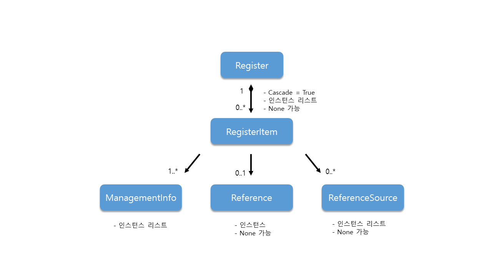

# S100-Registry system
- s-100의 registry 클래스 다이어그램을 파이썬으로 구현하였습니다.
- 개발환경 : python 3.9

<br>


## 디렉토리 구성

```
📁 S100-Register\python
	ㄴ1️⃣ register_model.py
	ㄴ2️⃣ validation.py
	ㄴ3️⃣ run.py
	ㄴ4️⃣ main.py
	ㄴ5️⃣ sample_data.py
```

- `register_model.py`에 클래스 다이어그램을 구현하였습니다.

- `run.py` 에서 데이터를 입력하고 조회하는 기능을 간단하게 만들어놓았습니다.

<br>


## 실행 방법

`\S100-Register` 경로에서 다음의 코드를 실행시킵니다. 

```
python main.py
```

<br>

## 구현 내용 

- 다음의 내용을 반영하여 구현하였습니다.


<br>

### register_model.py

- 인스턴스 생성은 클래스의 생성자를 활용했습니다. 
- 1..1인 데이터들만 생성자로 먼저 받아와 저장하고, 0..n 의 경우는 None으로 인스턴스 변수를 초기화하였습니다.
- 추후 필요할 때 메서드를 사용하여 속성 정보를 추가하도록 했습니다. (`add속성명()`)
- n..* 은 여러개의 인스턴스를 가질 수 있게 list로 구현하였습니다. (0..*은 [] 빈 리스트로 초기화)
- date 자료형은 클래스를 선언할 때 자료형을 지정해주지 않아서, 데이터를 입력하는 단계에서 validation을 거친 후 저장하는 식으로 처리하였습니다. (`validation.py`)
-  `viewItem()` 메서드로 등록한 데이터를 조회할 수 있게 했습니다.
<br>

### run.py

- `main.py` 함수를 실행하면  `run.py > run()` 을 호출합니다.
- run() 함수는 다음과 같이 동작합니다.
	```
	1. Register 생성
	2. RegisterItem 생성
	3. RegisterItem을 Register에 추가
	```

- 각 단계에서 모두 출력 결과가 있습니다.
	```
	1. Register 생성
		- 생성한 레지스터의 정보가 출력됩니다.
	
	2. RegisterItem 생성
		- 생성한 아이템의 정보가 출력됩니다.
	
	3. RegisterItem을 Register에 추가
		- Register에 추가된 아이템 이름이 목록 형태로 출력됩니다.
	```

<br>

### validation.py
- `enumValid` : 입력한 값이 enum에 있는지를 검증하고, 없으면 ValueError를 발생시킵니다.
- `dateValid` : 입력한 값이 datetime 자료형인지 검증하고, 아니면 ValueError를 발생시킵니다.
